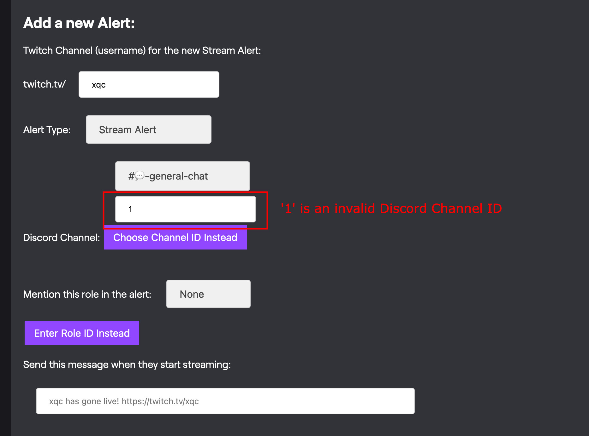

# CLYPPY Alerts

## Adding an Alert

To add a New Alert, navigate to the "Add a New Alert" section on the dashboard.


Select the type of alert you'd like to add, then click the "Add" button.

```{note}
**This is just a basic example.** Read on to see how to choose the Disord channel for your alert, and more options.
```

### Discord Channel Selection

Before you add an alert, you should think about which Discord channel you'd like to receive the notifications in.

This can be configured in the "Discord Channel" field of the new alert form. You have two options:

- Select a channel from the dropdown list.
- Enter a Discord Channel ID manually by clicking the "Enter Channel ID Instead" button.


```{note}
After you enter the Channel ID manually, note that the dropdown's selection **will not change**. This is normal, and the Dashboard will simply ignore the dropdown selection in favor of the manually entered Channel ID.
```

For more help, see the [How to Copy Channel ID](https://help.clyppy.com/developer-mode#how-to-copy-channel-id) section.

---

### Additional Notes

```{note}
Your dashboard won't warn you if you enter an invalid Channel ID manually! Before continuing, make sure the dashboard correctly loaded the channel name in your 'Summary' section (under the new alert).
```

### For Example



Entering a Discord Channel ID that doesn't match any in your server will result in "Not found" appearing in the 'Summary' section:


Since the channel ID is invalid, the alert will not work. 

**The Dashboard will not warn you about this!** Please verify that the channel name is correctly loaded in the 'Summary' section before continuing.
