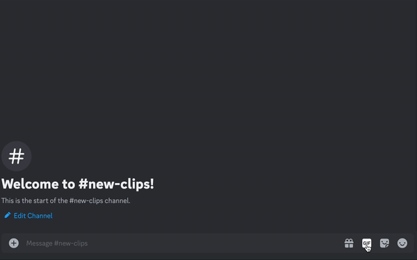
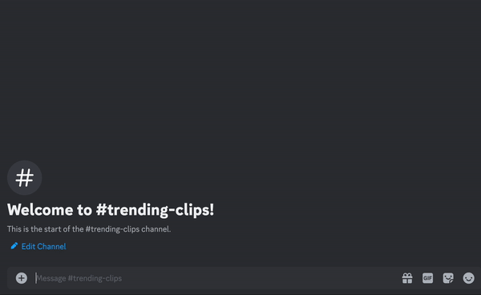

# Clip Alerts

There are two types of Clip Alerts: `New Clip` 

and `Trending Clip`.

Add the `New Clip` alert to receive a notification when a new Twitch Clip is created for a Twitch Channel.

The `Trending Clip` alert will notify you when a clip enters the 'top' section for its corresponding Twitch Channel.

Use whichever clip alert type you prefer, or both!

## More info

For more information on how to set up alerts, see the [Alerts](alert.md) page.