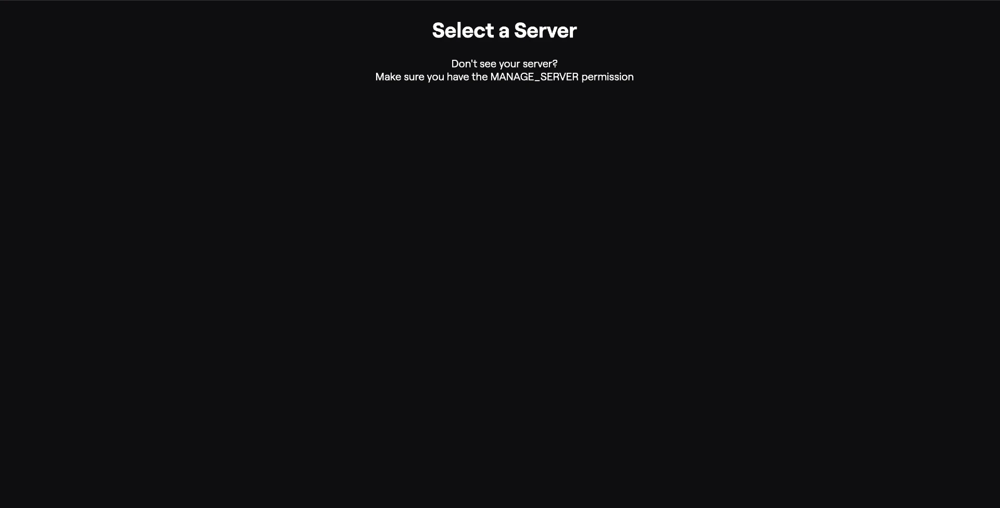

# CLYPPY Dashboard

## Introduction

The CLYPPY Dashboard is a web-based interface that allows you to manage your alerts and settings for CLYPPY. 

## Getting Started

After connecting your Discord Account to the CLYPPY Dash by logging in, you'll be greeted with the Dashboard's main page displaying all Discord Servers you're an Admin of.

CLYPPY determines if you're an Admin by checking if you have the `MANAGE_SERVER` permission in the server. If you don't see a Server in the Dashboard, you may need to reach out to the Server Owner or an Admin to grant you the necessary permissions.

## Server List

The Server List displays all Discord Servers you're an Admin of. To view the Dashboard for a specific server, click on the Server Name.

## Server Dashboard

The Server Dashboard displays all Alerts and Settings for the selected server. From here, you can manage Alerts, Settings, and more. 

For more information on how to set up Alerts, see the [Alerts](alerts.md) page.

## Troubleshooting

### Known bugs:

#### No Servers Listed

If your Dashboard appears blank with no Servers listed, try the following fix:

- Log out of the Dashboard by hovering over your Discord Profile in the top-right corner, and clicking "Logout".
- Log back in by visiting "Dashboard" or "Login"

This bug is caused by an incorrect discord session token stored by the CLYPPY website. Logging out and back in will refresh the session token, which should fix the issue.

#### Alerts Not Sending

If your Alerts are not sending, try the following fix:

- Ensure that CLYPPY has the necessary permissions in your Discord Server. For more information, see the [Invite CLYPPY](invite.md) page.
- Verify that the Alert is correctly configured in the Dashboard. For more information, see the [Alerts](alerts.md) page.

#### Quick Embed Not Working

- Ensure that CLYPPY has the necessary permissions in your Discord Server. For more information, see the [Quick Embed](quickembed.md) page.

---

If you encounter any other issues, please reach out to the [CLYPPY Support Team](https://clyppy.com/support) for assistance.
