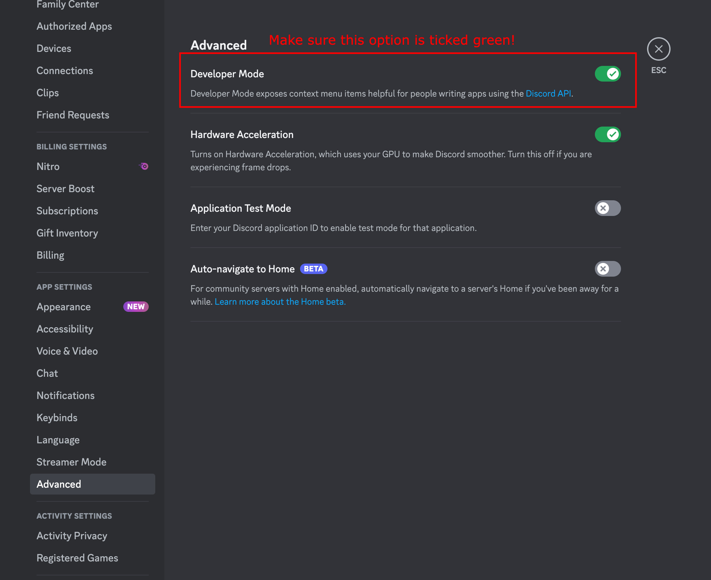
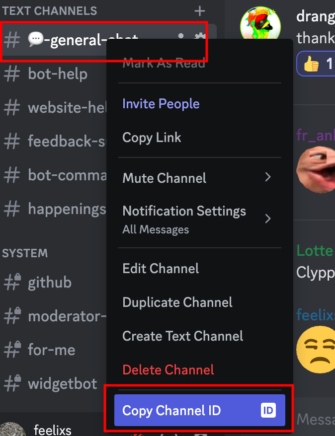
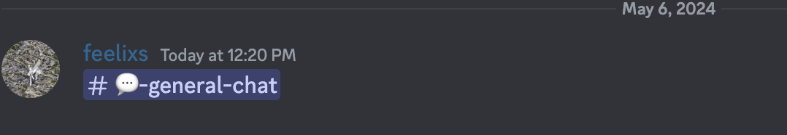
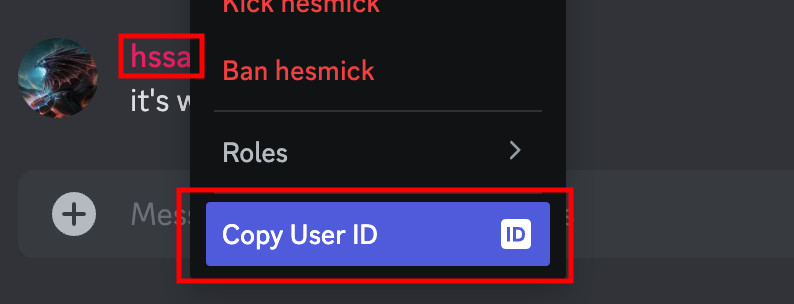
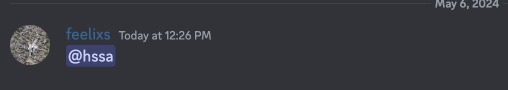

# Discord Developer Mode

## What is Developer Mode?

Discord Developer Mode is a feature that allows you to see the IDs of various elements in Discord. This is useful for many reasons, such as:

- Identifying the ID of a user, server, or channel.
- Debugging issues with bots or other Discord features.
- Providing debugging information to developers.

Note that Developer Mode is **not needed** for using CLYPPY. This guide merely serves as a reference for those who want to use it.

## How to Enable Developer Mode

To enable Developer Mode in Discord, follow these steps:

1. Open Discord and navigate to your User Settings.
2. Scroll down to the "Advanced" section.
3. Toggle the "Developer Mode" switch to the right.



Now you're ready to explore Discord in a new light!

---

## How to Copy Channel ID

To copy a channel ID in Discord, follow these steps:

1. Navigate to the Server that contains the channel you want to copy.
2. Right-click the channel you want to copy.
3. Click "Copy ID" from the context menu.



Now you can paste the channel ID wherever you need it!

If you'd like a dynamic link to the channel, you can post it in the following format into a Discord chat:

```
<#CHANNEL_ID>
```

This results in a clickable link to the channel!



---

## How to Copy User ID

To copy a user ID in Discord, follow these steps:

1. Right-click the user you want to copy.
2. Click "Copy ID" from the context menu.



Paste it wherever you need it!

You can also create a dynamic mention to the user by posting it in the following format into a Discord chat:

```
<@USER_ID>
```

And it will display the user's profile as an interactable mention!



This can be useful if you know the user's ID but not their username.

---
