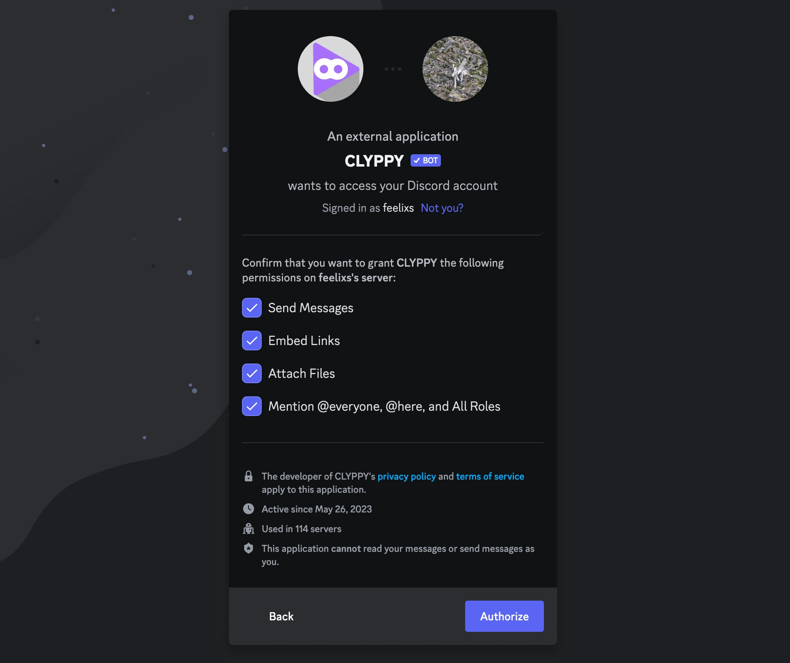

# Documentation

```{note}
We're Open Source! Feel free to improve the Docs yourself.
```

To get started, invite CLYPPY to your Discord server with at least the following Permissions checked off: `SEND_MESSAGES`, `EMBED_LINKS`, `MENTION_EVERYONE`



```{note}
This part is important, as it will allow CLYPPY to send alerts correctly!
```

The additional required Permission, `ATTACH_FILES`, is required if you plan on using CLYPPY's `/embed` command feature. Without the Attach Files permission, Discord won't allow the bot to upload video files to your server.

## All set?


After successfully inviting CLYPPY to your server, you're ready to [add your first alert](alert.md) so CLYPPY knows what you'd like to be notified about!
