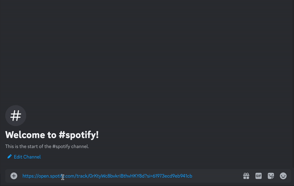
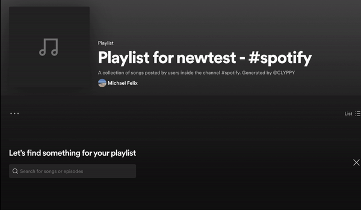

# Playlist Generator

```{important}
CLYPPY's Playlist Generator functionality has been transferred to the [Mixtape Bot](https://mixtape.clyppy.com) as of March 23, 2024. Mixtape can add this functionality to your server in the same way! (Invite Mixtape)[https://discord.com/oauth2/authorize?client_id=1221062771127615540].
```

 ---

```{note}
To interact with and customize CLYPPY's Playlist Generator, you must use Slash Commands (`/playlist` and `/prm`). Integration into the CLYPPY Dashboard will come soon! 
```

## Setting up the Generator

CLYPPY allows users to generate spotify playlists from links sent within a Discord channel.

```{admonition} Usage
:class: tip
Simply use the `/playlist` command within any Discord channel, and CLYPPY will start watching that channel for new Spotify links!
```




Using the `/playlist` command also scans the past 100 messages in the current channel for Spotify links, adding them to the new playlist as well.

```{important}
CLYPPY will prompt you to login with Spotify. Use the `/spotify_connect` command to get a Spotify OAuth link, which will authorize the application to create a playlist on your Spotify Account and add songs to it.
```

---

## Removing the Generator

If at any time you'd like to stop collecting songs from a channel where you previously used the `/playlist` command, you can remove that channel by using `/prm`.

The `/prm` command looks at the channel it's used in and tells CLYPPY to stop scanning new messages in that channel for Spotify links.

Then, when you're ready to resume the generator in a channel, simply re-use the `/playlist` command in that channel.

## De-Authorize CLYPPY as a connected Spotify App

If you'd like to stop using CLYPPY's Playlist Generation feature, you can disconnect the app from your Spotify Account by revoking access to CLYPPY through [your Spotify connected Apps](https://www.spotify.com/us/account/apps/).

After revoking access, it may take up to an hour for the changes to take effect.
