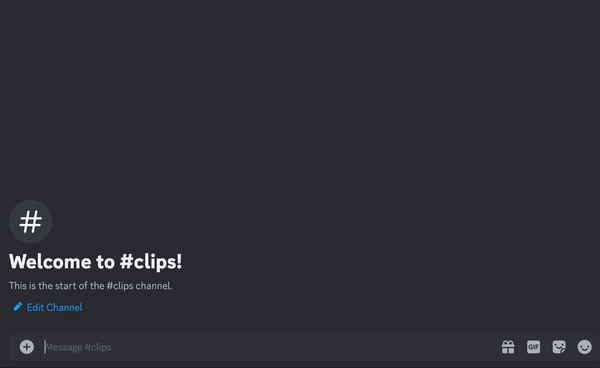

# Quick Embeds

```{note}
Quick Embeds currently only support Twitch Clips. To embed videos from other platforms, use the `/embed` command ([more info](https://help.clyppy.com/embed))
```

## Using Quick Embeds

Quick Embeds are a simple way to embed Twitch Clips into your Discord chat. Simply paste the Twitch Clip URL into your chat, and CLYPPY will automatically embed the video for you.



## Troubleshooting

If the video doesn't embed, there are a few things you can check:

### Valid URLS

Make sure the URL is correct and that the video is a Twitch Clip. Quick Embeds will only trigger on URLS for Twitch Clips (including clyppy.com/clips links).

### Incorrect Permissions

If CLYPPY doesn't have the `ATTACH_FILES` permission, it won't be able to embed the video. Make sure CLYPPY has the correct permissions in the channel you're trying to embed the video in.


